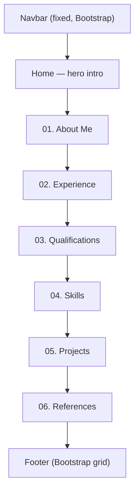

# Wadea YH — Developer Portfolio

A single-page personal portfolio site built with plain HTML5 and CSS3, styled as a dark, terminal-inspired
developer profile (`~/wadea`, bracket-style links, monospace type, glowing accent colors). Bootstrap is used
sparingly — only for the navbar and the footer grid — everything else (layout, cards, animations, timeline,
stats) is hand-written CSS.

---

## Built With

| Piece | Choice |
|---|---|
| Markup | HTML5 |
| Styling | CSS3 (Flexbox + CSS Grid, no preprocessor) |
| Framework | [Bootstrap 5.3.8](https://getbootstrap.com/) — via CDN, **navbar + footer grid only** |
| Fonts | Google Fonts (`Inter`) + local/system monospace stack |
| Icons | Inline SVG / plain text glyphs (`</>`, `[ ]`) — no icon library |
| JS | Bootstrap's bundled JS (navbar collapse toggle only) — no custom JavaScript |

No build tools, no package manager — this is served as static files.

---

## Project Structure

```
Portfolio_Project/
├── HTML/
│   └── Index.html          # the site — single page, all sections
├── CSS/
│   └── Index.css           # all custom styling (~1300 lines)
└── ReadMe.md                 # this file
```

`test.html` / `test.css` are a scratch pad used to prototype effects (loading spinners, breakpoint demos,
typewriter effects, the glow/float icon animation) before wiring the final version into `Index.html`. They
aren't part of the deliverable page and can be deleted before submission if you want a cleaner repo.

### Page flow (top to bottom)



Each content section (`B`–`H`) is a `<section>` with its own class (`.Home`, `.AboutMe`, `.Experience`,
`.Qualifications`, `.Skills`, `.Projects`, `.References`) and is separated from the next by a plain `<hr>`.

---

## Design System

### Color Palette

The whole site sits on pure black, with white body text and **five accent colors** borrowed straight from a
terminal/syntax-highlighting palette. Nothing is a custom hex for the accents — they're all CSS named colors,
used consistently as "this color = this meaning":

| Color | Value | Used for |
|---|---|---|
|  `aqua` | `#00FFFF` | Primary accent — links/hover, section underlines, card top-borders, the `</>` glow icon, "Years Coding" stat, GitHub/LinkedIn bracket links |
|  `deeppink` | `#FF1493` | Secondary accent — hover states (buttons, links), text selection highlight, "Trainer Role" stat |
|  `orange` | `#FFA500` | Tertiary accent — anything "Orange Jordan"-related, Frontend skill card, "Competitions Placed" stat |
|  `#8b5cf6` | `#8B5CF6` | Backend skill card accent |
|  `greenyellow` | `#ADFF2F` | Tools skill card + RoadNa project accent |
|  `black` | `#000000` | Page background |
|  `white` | `#FFFFFF` | Primary text |
|  `gray` / `#808080` / `#888` | — | Secondary/muted text (hero tagline, card meta info, footer captions) |

Each **Skill card** and the **References cards** use a "modifier class" pattern to pick their accent:
`.skillCard--purple`, `.skillCard--green`, `.skillCard--orange`, `.skillCard--deepPink`,
`.refCard--pink`, etc. — the base class supplies the shared structure, the modifier only overrides color.

### Typography

| Role | Font stack | Where |
|---|---|---|
| Body / UI text | `'JetBrains Mono', 'Fira Code', ui-monospace, monospace` | Everywhere by default (set on `<body>`) |
| Headings (`h1`, card titles) | `'Inter', ui-sans-serif, system-ui, sans-serif` | Hero `<h1>`, `.card h3` |

Only **Inter** is actually loaded from Google Fonts (weights 400/500/600/700/800) — `JetBrains Mono` and
`Fira Code` are **not** linked anywhere, so they only render if the visitor happens to already have one
installed; otherwise the browser silently falls back to its default `monospace` font. That's fine for the
terminal look (most default monospace fonts read similarly), but worth knowing if the site ever looks
different on someone else's machine.

### Recurring visual motifs

- **Terminal branding** — the logo is literally `~/wadea` with a blinking `|`/`_` cursor (`.terminalChar`,
  animated via `@keyframes blink`).
- **Bracket links** — external links are styled as `[ GitHub ]`, `[ LinkedIn ]`, `[ Email ]` instead of normal
  underlined links, everywhere in the site (hero, projects, footer).
- **Numbered section headers** — every section title is prefixed `0X.` (`01. About Me`, `02. Experience`, …)
  with a short aqua underline (`.sectionLine`).
- **Glow effects** — a blurred, pulsing colored circle sits behind both the hero `</>` icon and the About Me
  stats panel (`.glow-blur`, `filter: blur(60px)`, `@keyframes pulseGlow`).
- **Scroll-reveal** — every `<section>` and `.card` fades and scales in as it enters the viewport using a
  CSS scroll-driven animation (`animation-timeline: view()`), no JavaScript involved. Note: this is a
  Chromium-only CSS feature — Safari/Firefox will just show the content instantly with no animation, which is
  a safe fallback (nothing breaks, it just isn't animated).

---

## Sections Breakdown

### Navbar — Bootstrap component #1
Fixed to the top (`#mainNav`), built from Bootstrap's `navbar` + `navbar-collapse` classes for the mobile
hamburger behavior, but colored/typeset with custom CSS (`aqua` bottom border, monospace logo, custom
underline-on-hover for links).

### Home (`.Home`) — hero intro
`<h1>` greeting + a short tagline (`.hero-description`), a "View CV" button linking out to a Google Drive
file, and GitHub/LinkedIn bracket links. The glowing `</>` icon (`.hero-icon`) is `position: absolute` and
hides below 1080px width since there's no good place to put it once the hero text needs the full column.

### About Me (`.AboutMe`)
Two-column layout on wide screens: bio paragraphs + a `>`-prefixed highlights list on the left
(`.aboutMeText`), and a glowing stats panel on the right (`.aboutStats`) with three big colored numbers.
The stats panel hides below 1080px (same reasoning as the hero icon) and the whole section collapses to a
single column on top of it.

### Experience (`.Experience`)
A flex-wrapping row of `.card` elements (fixed `320px` width) — internship/role cards with a role, company,
dates, and a short description.

### Qualifications (`.Qualifications`)
A vertical timeline (`.QualificationContainer` → `.qualEntry`) — each entry has a colored dot + year on the
left (`.qualMarker`) and a degree/program description on the right (`.qualContent`), connected by a left
border line. A large italic quote (`.qualQuote`) floats in the corner on very wide screens only (hidden below
1429px to avoid overlapping the timeline).

### Skills (`.Skills`)
A responsive CSS Grid (`.skillsGrid`, 3 → 2 → 1 columns) of `.skillCard`s, one per category, each holding a
row of `.pill` tags.

### Projects (`.Projects`)
Reuses the same `.skillsGrid`/`.skillCard` pattern as Skills, extended with a project screenshot
(`.projectImg`) and a `.projectLinks` row pinned to the bottom-left corner of the card (GitHub / Live Demo).

### References (`.References`)
`.refCard`s with a colored left border, an italic quote, the referee's name/role, and their email.

### Footer — Bootstrap component #2
Built on Bootstrap's `row`/`col-*` grid (not Bootstrap's color utilities — those collide with this site's own
custom dark theme, see the note below). Three columns: brand + tagline, a NAVIGATE link list, and a CONNECT
link list in the site's bracket style, followed by a copyright / "Built with `</>` and coffee" line.

> **Why not Bootstrap's `bg-dark` / `text-*` utilities?** Bootstrap ships those with `!important` baked in,
> so a custom override of the same class name can never win. The footer originally used `bg-dark` and the
> background silently stayed Bootstrap's default gray instead of this site's near-black — it's now styled
> entirely with custom classes (`.siteFooter`, `.footerBrand`, `.footerLinks`, …) to avoid that trap.

---

## Card / Component Specs

| Component | Class(es) | Fields | Notes |
|---|---|---|---|
| **Experience card** | `.card` | number, role title, company, location + dates, description | Fixed width `320px`; border is a plain white outline, no accent color |
| **Qualification entry** | `.qualEntry` (+ `.qualMarker`, `.qualContent`) | year range, colored dot, degree/title, org, description | Dot + org color is set per-entry via `#id` (e.g. `#qual-42`), not a reusable modifier class yet |
| **Skill card** | `.skillCard` + `.skillCard--{color}` | category title, list of `.pill` tags | 5 variants: cyan (default), purple, green, orange, deepPink |
| **Project card** | `.skillCard` + a one-off modifier (`--SmartCity`, `--irbid`) | title, screenshot, description, tech pills, links | Same base as Skill cards; links are absolutely positioned to the bottom-left so they line up across cards of different text lengths |
| **Reference card** | `.refCard` (+ `.refCard--pink`) | quote, name, role, email | Left border color is the only thing the modifier changes |
| **Stat item** (About Me) | `.statItem` (+ `.statNumber--{cyan,orange,pink}`) | big number, label | Deliberately built with `<div>`s, not `<p>` — a `<p>` here would have been overridden by a more specific `.AboutMe p` color rule elsewhere in the sheet |

---

## Responsive Breakpoints

The same three-tier breakpoint system repeats across every section:

| Breakpoint | Left padding | What changes |
|---|---|---|
| `min-width: 769px` (desktop) | `135px` | Full multi-column layouts (Skills/Projects grid at 3 columns, About Me two-column stats) |
| `481px – 768px` (tablet) | `50px` | Grids drop to 2 columns; two-column sections (Home/About Me stats, hero icon) collapse to one |
| `max-width: 480px` (phone) | `20px` | Grids drop to 1 column; decorative elements (hero icon, qualifications quote) stay hidden |

Two decorative elements are intentionally hidden below `1080px` rather than repositioned: the hero `</>` icon
and the About Me stats panel — both are absolutely-positioned/side-column extras with no good mobile layout,
so hiding them was simpler and safer than fighting overlap bugs on every phone size.

---

## Running Locally

No build step — just serve the folder and open `HTML/Index.html`:

```bash
npx serve .
```

Then visit the printed `localhost` URL and navigate to `/HTML/Index.html`.

---

## Author

**Wadea YH** — Full Stack Developer Trainer @ Orange Jordan
[GitHub](https://github.com/WadeaYH) · [LinkedIn](https://www.linkedin.com/in/wadea-yh-2188b6278/)